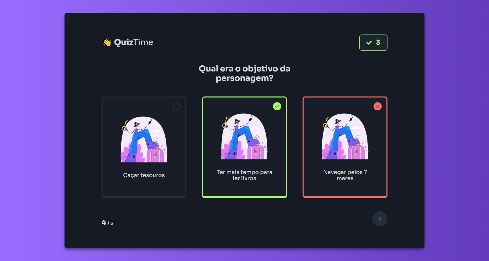

## QuizTime | #boraCodar
> #boraCodar - Rocketseat

QuizTime | #boraCodar

Nesse projeto aprimorei mais os meus conceitos sobre o React, com componentização, temas globais e estilização com StyledComponents. Com isso pude aplicar estes conceito em diversos outro projetos adquirindo mais familiaridade com eles.  
 - Abaixo está o link com o projeto.

[🔗 Clique aqui para acessar](https://focus-timer-rocket.netlify.app/)

## 🛠️ Tecnologias

